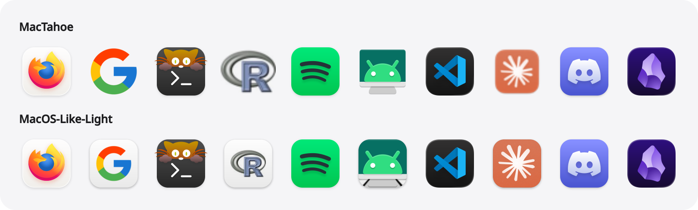
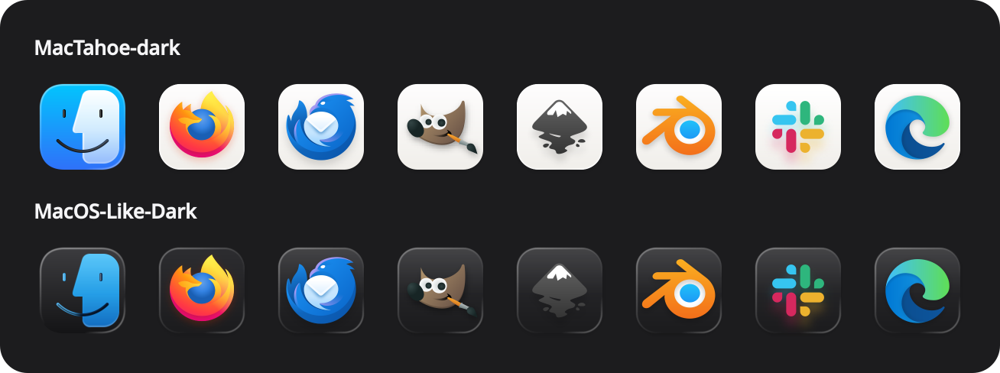

# MacOS-Like

[MacTahoe](https://github.com/vinceliuice/MacTahoe-icon-theme) is a beautiful
macOS Tahoe icon theme for Linux, but it can only theme the apps it has artwork
for. Everything else keeps its original icon, so your launcher ends up with neat
rounded tiles sitting next to bare logos. Its dark variant also keeps the same
bright white tiles as the light one.

MacOS-Like fills those gaps. It builds two icon themes on top of MacTahoe, for
KDE Plasma and for GTK desktops like GNOME:

- **MacOS-Like-Light**: every app you have installed that MacTahoe doesn't cover
  gets its own artwork placed on a Tahoe-style tile, so everything matches.
- **MacOS-Like-Dark**: the same, plus dark glass versions of MacTahoe's white
  tiles and the dark Finder icon from macOS Tahoe.

## Before and after

In each image, the top row is MacTahoe as it ships and the bottom row is
MacOS-Like.





In the light theme, apps MacTahoe already covers (Firefox, Kitty, Spotify, ...)
stay exactly as they are. Only the ones it doesn't cover (Google, R, scrcpy and
Claude above) change, so they finally match the rest. The dark theme also
darkens the white tiles of the apps MacTahoe does cover. The script only makes tiles for the apps on your own system, so your set
will look different. To render these images from your own themes, run
`python3 screenshots/render.py` after `./setup.sh` (it needs PyQt6).

## What you need

| Needed              | Arch                            | Debian / Ubuntu       | Fedora                |
| ------------------- | ------------------------------- | --------------------- | --------------------- |
| Python 3 + Pillow   | `python-pillow`                 | `python3-pil`         | `python3-pillow`      |
| `rsvg-convert`      | `librsvg`                       | `librsvg2-bin`        | `librsvg2-tools`      |
| `rsync`             | `rsync`                         | `rsync`               | `rsync`               |
| MacTahoe icon theme | `mactahoe-icon-theme-git` (AUR) | upstream `install.sh` | upstream `install.sh` |

If anything is missing, the script tells you which package to install before it
starts.

You don't have to install MacTahoe first. If the script can't find it, it offers
to download it from GitHub and install it for you (this needs `curl` or `wget`).
An existing copy works too, whether it's in your home folder or installed
system-wide.

Optional: `gtk4-update-icon-cache` (or `gtk-update-icon-cache`) to refresh GTK's
icon cache, and [matugen](https://github.com/InioX/matugen) if you want the
folder colors to follow your wallpaper (see [Folder colors](#folder-colors)).

## Install

```sh
git clone https://github.com/Scrimas/MacOS-Like.git
cd MacOS-Like
./setup.sh
```

The themes go into `~/.local/share/icons/MacOS-Like-Light` and
`~/.local/share/icons/MacOS-Like-Dark` (or `$XDG_DATA_HOME/icons` if you set it).
Run it again whenever you install new apps. Icons it already made are kept, so
later runs only do the new ones.

Two other ways to run it:

```sh
./setup.sh --dry-run   # show what it would generate, change nothing
./setup.sh --force     # redo every icon from scratch
```

Then pick the theme:

- **KDE Plasma:** System Settings → Colors & Themes → Icons.
- **GNOME:** `gsettings set org.gnome.desktop.interface icon-theme MacOS-Like-Dark`
  (or `MacOS-Like-Light`).

### Options

- `--source NAME|DIR` builds from another MacTahoe color variant, such as
  `MacTahoe-nord`, or from a theme folder. Its `-dark` sibling is used for the
  dark theme.
- `--inherits-light LIST` and `--inherits-dark LIST` choose the fallback themes
  for icons MacTahoe has no version of at all, for example
  `Papirus-Dark,hicolor`. By default the script uses the first of breeze-plus,
  breeze, Papirus and Adwaita that you have installed.

### Using your own artwork for an app

If you'd rather see a different picture for a particular app, even one MacTahoe
already covers, copy `overrides.conf.example` to
`~/.config/macos-like/overrides.conf` and add lines like:

```
ryujinx=/usr/share/pixmaps/ryujinx.svg
```

The name on the left is the app's `Icon=` value from its `.desktop` file. On the
next run that file is put on a tile in place of MacTahoe's icon.

## Folder colors

MacTahoe's folders are blue. `matugen/recolor_folders.py` can recolor them, and
the color survives rebuilds:

```sh
python3 matugen/recolor_folders.py --color '#e5a50a'   # pick a color
python3 matugen/recolor_folders.py --setup             # follow matugen's palette
python3 matugen/recolor_folders.py --restore           # back to blue
```

With `--setup`, the script adds itself to matugen as a post-hook, and the
folders take on your palette's color every time matugen runs (usually when you
change wallpaper). It edits
`~/.config/matugen/config.toml` for this, and saves a backup next to it first.
Running `--color` afterwards overrides the palette color until matugen runs
again.

If matugen is installed, `./setup.sh` will offer to do this for you. Answer no
and it won't ask again (delete `~/.config/macos-like/no-matugen-prompt` to be
asked again).

## Uninstall

```sh
rm -rf ~/.local/share/icons/MacOS-Like-Light ~/.local/share/icons/MacOS-Like-Dark
rm -rf ~/.local/state/folder-icons ~/.config/macos-like
```

If you used `--setup`, also remove the `[templates.folder_icons]` block from
`~/.config/matugen/config.toml`.

## Credits and license

The themes are built from [MacTahoe](https://github.com/vinceliuice/MacTahoe-icon-theme)
by vinceliuice, which is licensed under the GPL-3.0. The generated tiles use
each app's own icon as their artwork. MacOS-Like is released under the same
license ([GPL-3.0-or-later](LICENSE)), and each theme it builds keeps MacTahoe's
`COPYING` and `AUTHORS` files.
